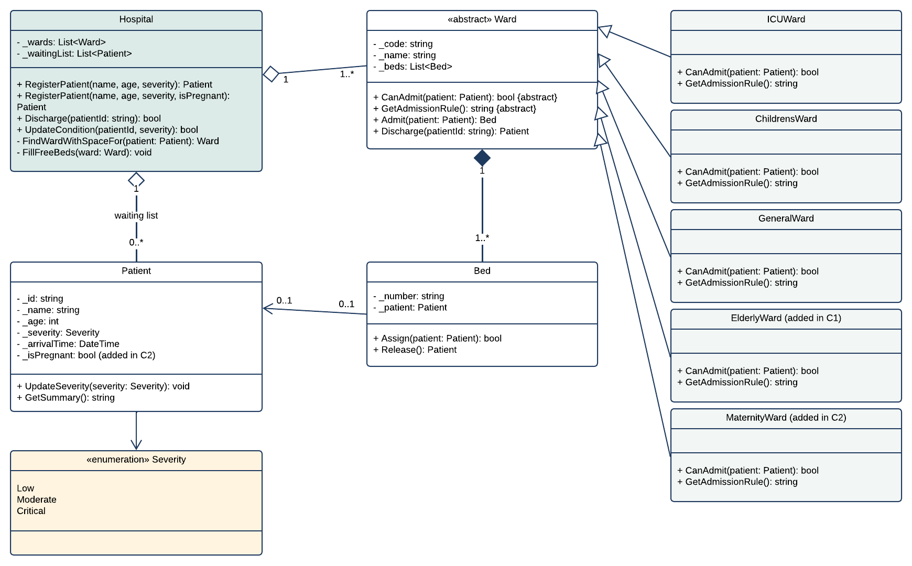
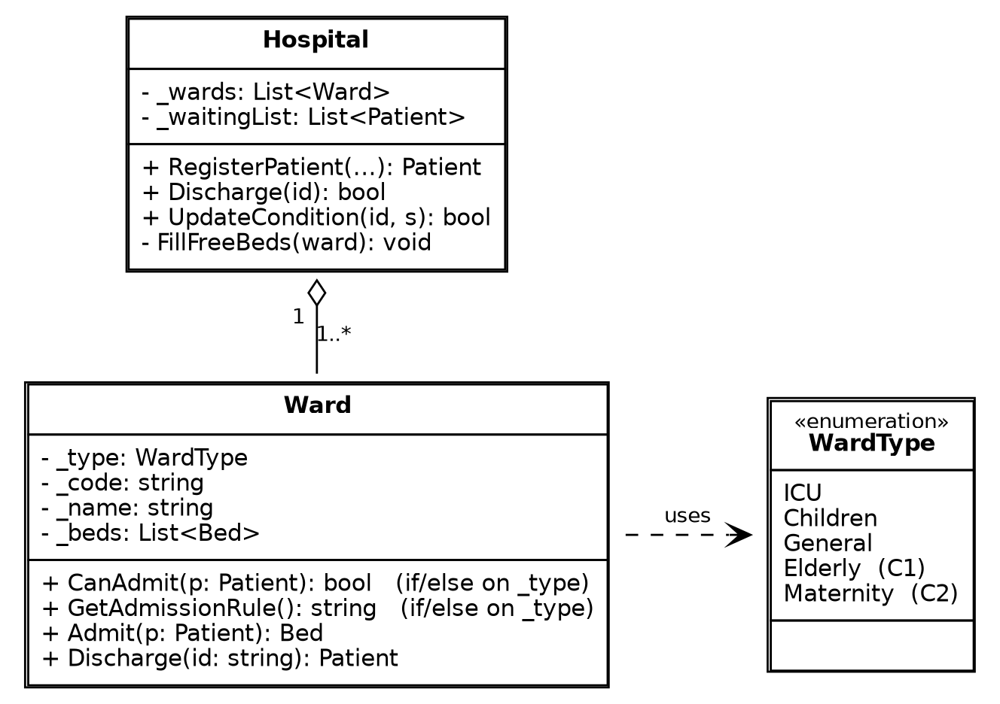

# SIT771 Task 7.4 (HD): Object Oriented Design Research Project

Shatabdi Das (s226086986)
SIT771 Object-Oriented Development, Deakin University

This repository holds the code, tests and results for my High Distinction research project.

## What the project is about

Patient Management is a hospital program I wrote earlier in the unit. When a patient arrives, the program chooses a ward for them: Intensive Care takes critical patients, the Children's Ward takes children, and the General Wards take adults who are not critical.

There are two common ways to write the code that makes this choice:

* **The if/else version:** one `Ward` class with a list of if/else checks. If this is Intensive Care, use this rule, otherwise if it is the Children's Ward, use that rule, and so on.
* **The class-per-ward version:** every kind of ward is its own class that holds its own rule. This uses the abstract classes, inheritance and polymorphism we learnt in the unit.

**Research question:** How does designing with abstraction, inheritance and polymorphism affect how easily a program can be extended and tested, compared with a design built on an enum and if/else statements?

**In simple terms:** when the hospital changes, which way of writing the code is easier and safer to update?

## The two versions

The same admission rules, written both ways (shortened):

```csharp
// If/else version: one Ward class
bool CanAdmit(Patient p)
{
  if (_type == WardType.ICU)
    return p.Severity == Severity.Critical;
  else if (_type == WardType.Children)
    return p.Age < 16 && ...;
  else if (_type == WardType.General)
    return p.Age >= 16 && ...;
  return false;
}
```

```csharp
// Class-per-ward version: one class for each kind of ward
class ICUWard : Ward
{
  override bool CanAdmit(Patient p)
  {
    return p.Severity == Severity.Critical;
  }
}
// ChildrensWard and GeneralWard are separate classes with their own rule
```

**The class-per-ward version** (folder `version-B-polymorphic`) is the original program. `Ward` is an abstract class that holds what every ward shares, such as the beds, and says every kind of ward must provide its own `CanAdmit` rule. The `Hospital` asks each ward "can you take this patient?" without checking what kind of ward it is.



**The if/else version** (folder `version-A-flat`) does exactly the same job with one ordinary `Ward` class that stores its type in a `WardType` enum. Everything else is the same, so the only difference is where the rules live. Before any change, both versions printed identical output on every test.



The diagrams can also be opened in [Lucidchart](https://lucid.app/lucidchart/c43ebfbf-2a3f-425a-a625-0f350c25f852/edit?invitationId=inv_e427f615-a624-44fc-bdd2-e396cd70c8ab) (view only).

## The four changes

I made the same four changes to both versions. In the commit messages they are called C1 to C4.

| Change | What it tests |
|---|---|
| **1. Add an Elderly Ward** (75 and over) | A new ward that only needs information the program already has |
| **2. Add a Maternity Ward** | A new ward that needs new information: whether the patient is pregnant |
| **3. Raise the Children's Ward age limit** from under 16 to under 18 | Editing a rule that already exists |
| **4. Add a Rehab Ward but forget to write its rule** | Which version notices the mistake |

## Results

After every change both versions passed all ten tests and printed identical output. This is what happened in each change:

| Change | If/else version | Class-per-ward version | Easier |
|---|---|---|:---:|
| **1. Add an Elderly Ward** | Had to open the existing Ward class and add a new branch to it. | Wrote one new class and one line to register it. No existing code was touched. | **Class-per-ward** |
| **1. (first attempt)** | An 80 year old was sent to a General Ward. Only a test caught it. | The same mistake, caught the same way. | **Neither** |
| **2. Add a Maternity Ward** | Adding the new patient information took the same work in both versions. The new rules all went into one file. | Adding the new patient information took the same work in both versions. The new rules touched four ward classes, because three other wards had to exclude pregnant patients. | **If/else** |
| **3. Raise the Children's Ward age limit to 18** | One file. All the rules are in one place. | Two ward classes had to change together. | **If/else** |
| **4. Add a ward but forget its rule** | The program ran with no warning. The new ward quietly admitted nobody. | The program would not compile until the rule was written. The compiler named what was missing. | **Class-per-ward** |

What this means:

* **New wards are safer to add when each ward has its own class,** because old code is not touched.
* **Only the class-per-ward version catches a missing rule.** The compiler refuses to build it, so the mistake is found before the program can run.
* **Rules that depend on each other are easier to change in one place,** which suits the if/else version.
* **Neither design helps when new information is needed.** Storing whether a patient is pregnant took the same work in both.
* **Tests caught what the design could not.** Neither compiler noticed that the first Elderly Ward rule overlapped with the General Ward. Only a test did.

### Detailed numbers

Files with code changes, and lines of code added and removed (comments and blank lines are not counted):

| Step | If/else version | Class-per-ward version |
|---|---|---|
| 1. Add Elderly Ward | 3 files, +7 / -1 | 2 files, +14 / -0 |
| 1. Fix overlap with General Ward | 1 file, +2 / -2 | 1 file, +2 / -2 |
| 1. Ward map layout | 1 file, +12 / -3 | 1 file, +12 / -3 |
| 2. Pregnancy information | 3 files, +30 / -6 | 3 files, +30 / -6 |
| 2. Maternity rules | 3 files, +10 / -4 | 5 files, +17 / -3 |
| 3. Children under 18 | 1 file, +4 / -4 | 2 files, +4 / -4 |

These numbers are small, so they are best read together with the table above. They are also in [`results/measurements.csv`](results/measurements.csv), and the compiler output from Change 4 is in [`results/C4_forgotten_rule_output.txt`](results/C4_forgotten_rule_output.txt). The [results README](results/README.md) explains how to recount them.

## Repository layout

| Folder or file | What it holds |
|---|---|
| `version-B-polymorphic/` | The class-per-ward version |
| `version-A-flat/` | The if/else version |
| `tests/inputs/` | Ten scripted test runs. Each line is one answer typed into the menu |
| `tests/expected/` | The output each test should print, with clock times replaced by `<TIME>` |
| `results/` | The measurements and the compiler output from Change 4 |
| `docs/` | Class diagrams of both versions |
| `run_tests.sh` | Runs every test on Mac or Linux |
| `run_tests.ps1` | Runs every test on Windows |

The `tests`, `results` and both version folders each have their own README with more detail.

## How to follow the work

The commit history shows the steps in the order I did them. Start from the oldest commit:

1. Step 0: the program as it was before the research started
2. Step 1: three small fixes, then the scripted tests and their expected output
3. Step 2: the if/else version built, with identical output to the class-per-ward version on every test
4. C1: the Elderly Ward. The first attempt failed a test in both versions, and the next commits show the fix
5. C2: the Maternity Ward
6. C3: the Children's Ward age limit
7. C4: on the separate branch `c4-forgotten-rule`, so the mistake does not stay in the main program

In the commit messages, "Version A" is the if/else version and "Version B" is the class-per-ward version. Each change has one commit for each version, so `git show <commit>` shows exactly what each design needed.

## Running the tests

You need the [.NET 8 SDK](https://dotnet.microsoft.com/download/dotnet/8.0). From the top folder of this repository:

On Windows (PowerShell):

```
.\run_tests.ps1 version-B-polymorphic
.\run_tests.ps1 version-A-flat
```

On Mac or Linux:

```
./run_tests.sh version-B-polymorphic
./run_tests.sh version-A-flat
```

Each one should finish with `10 passed, 0 failed`.

## Running the program

```
cd version-B-polymorphic
dotnet run
```

Choose option 9 to load the demo patients, then option 3 to discharge P001. A patient from the waiting list is given the free bed straight away. Option 8 opens the SplashKit ward map.

## Limitations

This is one small program and one developer, and lines of code are only a rough measure of effort. I built the if/else version myself, so I kept its rules inside the `Ward` class to make it as fair a comparison as I could. The ward map was checked by hand because the scripted tests cannot see a window.
